# RemoteComposeViewer-Android

**An Android app for browsing and rendering Remote Compose (`.rc`) binary UI documents.**

This app loads `.rc` files and renders them in real time using the official `RemoteComposePlayer` from Android's Remote Compose library. It includes 177 built-in demo files and can open custom `.rc` files from device storage.

<p align="center">
  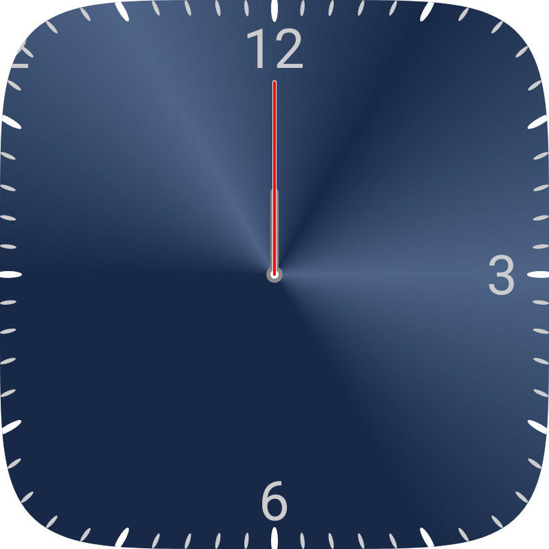
  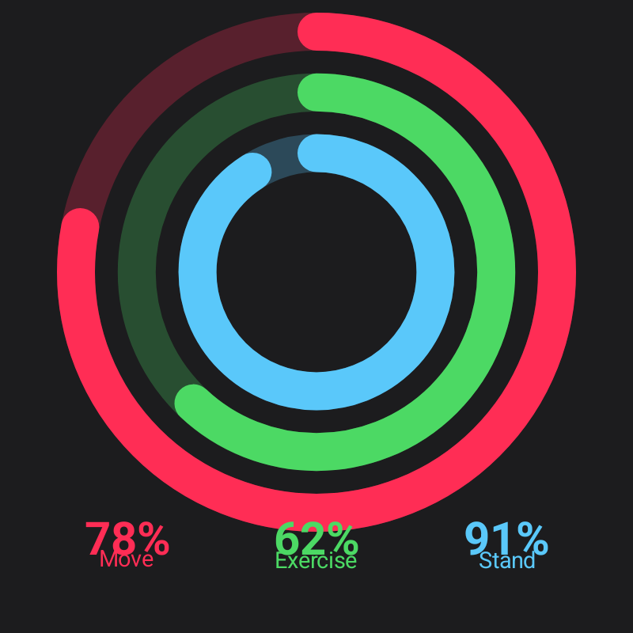
  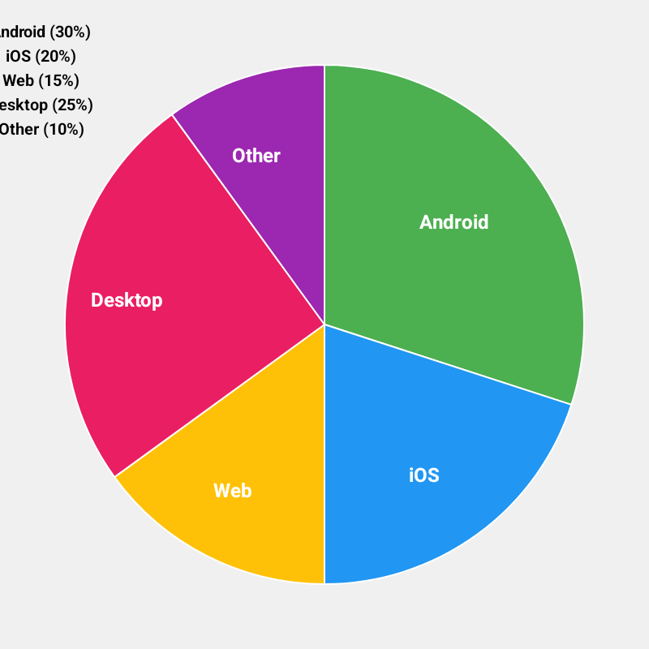
</p>

<p align="center">
  <em>All rendered natively on Android from compact .rc binary files (each under 5KB).</em>
</p>

---

## What Are `.rc` Files?

`.rc` (Remote Compose) files are a compact binary format for describing user interfaces — layouts, drawing operations, animations, and interactivity. They are the serialization format of Android's [Remote Compose](https://android.googlesource.com/platform/frameworks/support/+/refs/heads/main/compose/remote/) project.

A complete animated clock fits in under 2KB. A pie chart with labels fits in under 4KB. The format uses an RPN expression engine for animation and data binding — no scripting language, just a stack of math operations that the player evaluates each frame.

---

## Upstream Source & Attribution

This app renders `.rc` files using the **RemoteCompose player library** from the [AndroidX `compose/remote` tree](https://android.googlesource.com/platform/frameworks/support/+/HEAD/compose/remote/), part of the Android Open Source Project.

The `modules/remote-compose/` directory contains a vendored copy of the RemoteCompose player and core runtime sources (294 Java files). These files are unmodified from the upstream AndroidX source and retain their original copyright headers (`Copyright (C) 2023-2025 The Android Open Source Project`, Apache 2.0). The app code in `app/` (Kotlin — the demo browser and player integration) is original to this project.

See [Dependency Approach](#dependency-approach) for details on why the sources are vendored and what alternatives exist.

---

## The App

### Demo Browser

The app opens to a categorized browser showing all 177 built-in `.rc` demos. Demos are grouped by type — Clocks, Components, Color, Demos, Graphs, and more. A search bar filters by name. You can also import custom `.rc` files from device storage.

### Player / Renderer

Tapping a demo opens the player screen, which renders the `.rc` file in real time using `RemoteComposePlayer`. Built-in demos have prev/next navigation. Imported files show the file name and are added to a recent history.

### Features

- Jetpack Compose UI with Material Design 3
- Category-grouped demo browser with search
- Real-time `.rc` rendering via the official `RemoteComposePlayer`
- File import with persistable URI permissions
- Recent imports list (up to 5 files)
- Prev/next navigation for built-in demos
- Error handling with fallback display

### App Screenshots

<p align="center">
  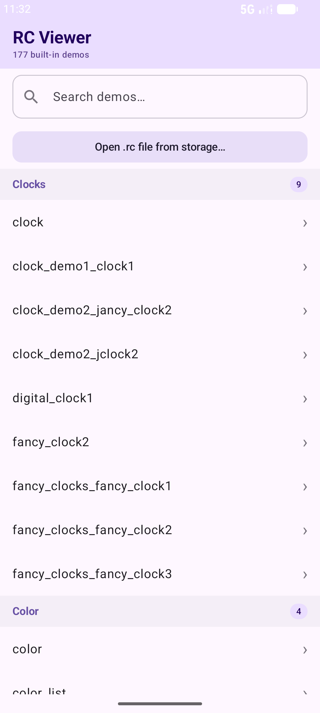
  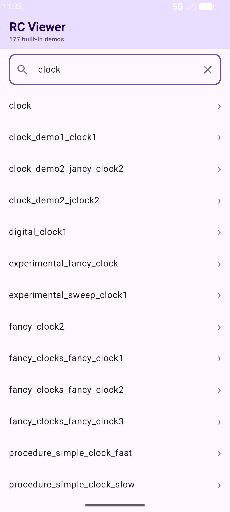
  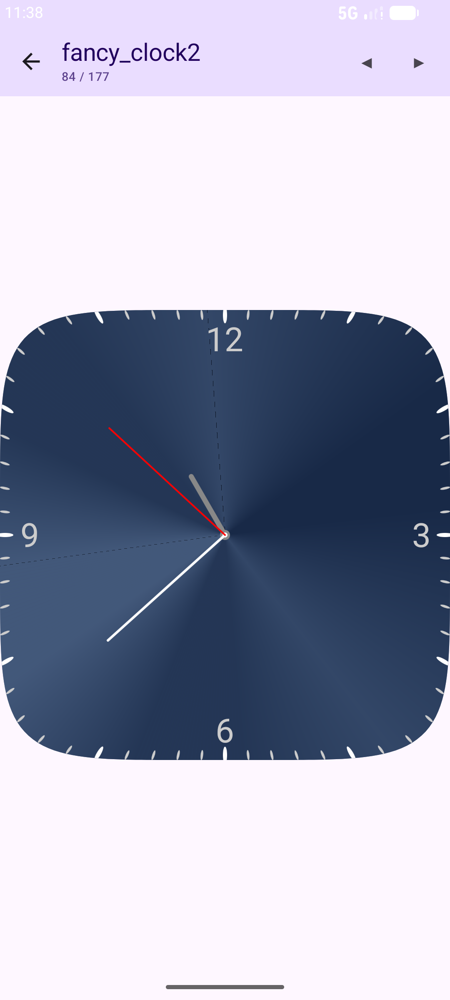
</p>

<p align="center">
  <em>Demo browser with categories | Search filtering | Player rendering a clock demo</em>
</p>

---

## Rendered Content Examples

All images below are real Android renders from `.rc` files included with the app.

### Clocks

<p align="center">
  
  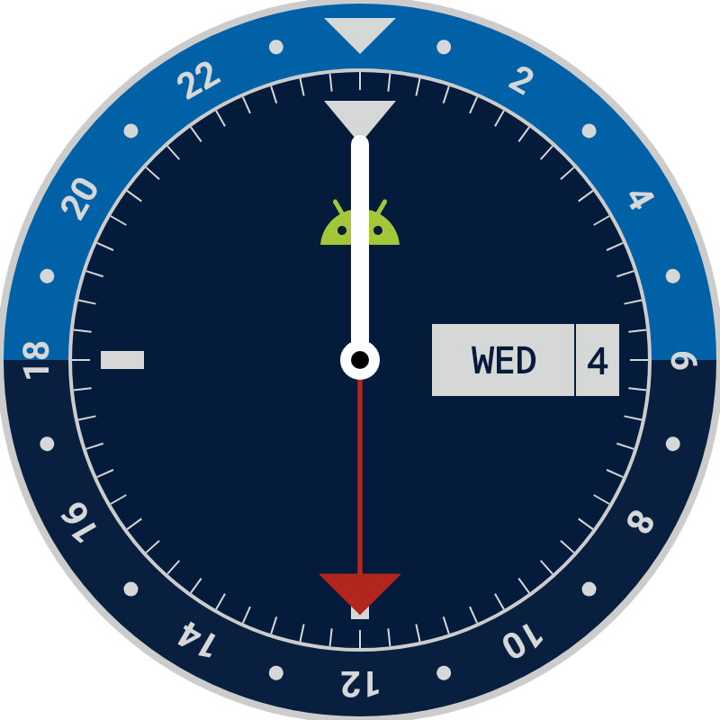
  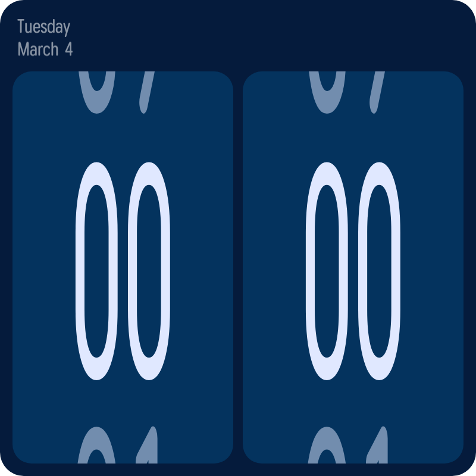
</p>

<p align="center">
  <em>Metallic sweep-gradient clock (2KB) | GMT clock with 24h bezel and date (3KB) | Flip-style digital clock (39KB)</em>
</p>

### Health and Data Visualization

<p align="center">
  
  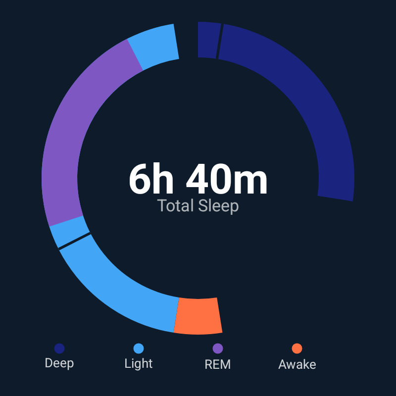
  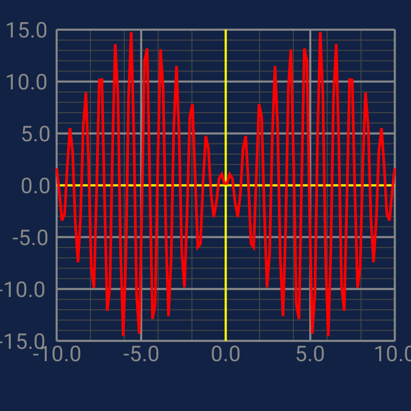
</p>

<p align="center">
  <em>Activity rings with labels (3KB) | Sleep quality breakdown (3KB) | Mathematical function plot (2KB)</em>
</p>

### Charts and Color

<p align="center">
  
  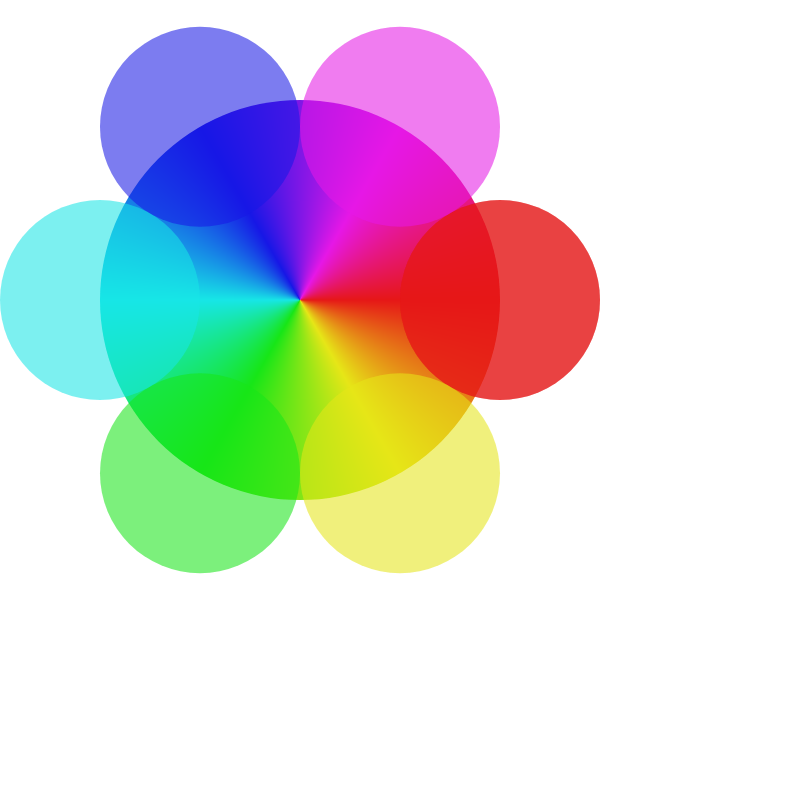
</p>

<p align="center">
  <em>Labeled pie chart (4KB) | HSV color expression wheel (2KB)</em>
</p>

---

## Quick Start

### Prerequisites

- **Android Studio** Ladybug or newer (AGP 9.1.0, Gradle 9.3.1)
- **JDK 11+** (bundled with Android Studio)
- **Android SDK** with compileSdk 36 installed
- **Android device or emulator** running Android 10+ (API 29+)

### Setup

1. **Clone the repository:**
   ```bash
   git clone https://github.com/Jason-Hoford/RemoteComposeViewer-Android.git
   ```

2. **Open in Android Studio:**
   - File > Open > select the cloned folder
   - Wait for Gradle sync to complete (first sync downloads dependencies)

3. **Run on device or emulator:**
   - Select a device/emulator running Android 10+ (API 29)
   - Click Run (green play button) or `Shift+F10`

4. **Browse demos:**
   - The app opens to a categorized list of 177 built-in demos
   - Tap any demo to render it
   - Use prev/next arrows to navigate between demos
   - Use the search bar to filter by name

5. **Open your own `.rc` files:**
   - Tap "Open .rc file from storage..." on the main screen
   - Select an `.rc` file from device storage
   - The file is rendered and added to recent imports

### Generating `.rc` Files

`.rc` demo files can be generated using the Python generator in the companion project [RemoteUI](https://github.com/Jason-Hoford/RemoteUI):

```bash
git clone https://github.com/Jason-Hoford/RemoteUI.git
cd RemoteUI
python demos/run_all.py
# Output: 219 .rc files in demos/output/
```

Transfer files to the Android device via `adb push` or file sharing and open them with the viewer.

---

## Project Structure

```
RemoteComposeViewer-Android/
├── app/                                # Android app module
│   ├── build.gradle.kts                # App build config (compileSdk 36, minSdk 29)
│   └── src/main/
│       ├── AndroidManifest.xml         # Activity declarations
│       ├── java/.../                   # Kotlin source
│       │   ├── MainActivity.kt         # Demo browser (categorized list, search, import)
│       │   ├── PlayerActivity.kt       # RC renderer (RemoteComposePlayer integration)
│       │   └── ui/theme/               # Material 3 theme
│       └── res/
│           ├── raw/                    # 177 built-in .rc demo files
│           └── ...                     # Icons, strings, themes
├── modules/
│   └── remote-compose/                 # Bundled RemoteCompose library
│       ├── build.gradle.kts            # Library build config
│       └── src/main/java/             # RemoteCompose player/core sources (294 Java files)
├── gradle/
│   ├── libs.versions.toml              # Version catalog
│   └── wrapper/                        # Gradle wrapper
├── build.gradle.kts                    # Root build config
├── settings.gradle.kts                 # Multi-module project settings
├── docs/assets/                        # Screenshots for README
└── LICENSE                             # Apache 2.0
```

### Key Components

- **`MainActivity.kt`** — Demo browser with category grouping, search, file import, and recent history. Discovers all `.rc` files from `R.raw` resources via reflection.
- **`PlayerActivity.kt`** — Renders `.rc` files using `RemoteComposePlayer` (the official Android RemoteCompose renderer). Supports both built-in demos (with prev/next navigation) and imported files.
- **`modules/remote-compose/`** — Vendored copy of the RemoteCompose player and core runtime sources from the AndroidX `compose/remote` tree. Includes the core runtime (262 files) and player (32 files). All files retain their original AOSP copyright headers.

### Dependency Approach

This project **vendors the RemoteCompose library as source code** rather than consuming it as a Gradle/Maven dependency. The 294 Java source files in `modules/remote-compose/` are compiled as a local Gradle module (`implementation(project(":remote-compose"))`).

**Why vendored source?** At the time this project was created, there was no published Maven artifact for the RemoteCompose player library. The upstream `compose/remote` code lives in the AndroidX support tree but is not yet distributed through Google's Maven repository as a standalone dependency.

**Maven/Gradle alternative.** If AndroidX publishes RemoteCompose artifacts in the future (as shown in the [PeopleInSpace integration](https://github.com/joreilly/PeopleInSpace/pull/452/files)), this project could replace the vendored source with a standard Gradle dependency like:

```kotlin
implementation("androidx.compose.remote:remote-compose-player:x.y.z")
```

This would eliminate the need to carry 294 source files and would automatically track upstream updates. This is a future cleanup task — the vendored approach works correctly today and the source files are unmodified from upstream.

---

## Current Status

The app is functional and stable for its primary use case: browsing and rendering `.rc` demo files on Android.

**What works well:**
- Rendering of all built-in demos via the official RemoteComposePlayer
- Real-time animation (clocks, gauges, data visualizations)
- Layout, text, paths, gradients, expressions, touch interactions
- File import from device storage
- Category browsing and search

**Limitations:**
- The internal package name (`com.example.myfirstapprc`) reflects the app's origin as a development tool — kept as-is to avoid a risky refactor
- No `.rc` file editor — this is a viewer/player only
- No export or sharing functionality
- RemoteCompose library sources are vendored as source rather than consumed from a published Maven artifact (see [Dependency Approach](#dependency-approach))

---

## Relationship to RemoteUI

This Android viewer app is a companion to [RemoteUI](https://github.com/Jason-Hoford/RemoteUI), a Python port of the Java/Kotlin RemoteCompose creation library. RemoteUI generates `.rc` files from Python; this app renders them using the official Android player.

**Why two repos?** They serve different roles. RemoteUI is a *generator* — it creates `.rc` binary files from Python code. This repo is a *viewer* — it renders `.rc` files on Android using the upstream `RemoteComposePlayer`. They share no code but operate on the same binary format.

**Validation workflow.** The Android viewer was used as part of end-to-end validation during RemoteUI development. Python-generated `.rc` files were loaded into this app to confirm they render correctly on the reference Android player. 11 demos were visually verified this way, including 6 purpose-built validation demos that exercise edge cases not covered by byte-level comparison.

Both projects are based on the same upstream source: the [AndroidX `compose/remote` tree](https://android.googlesource.com/platform/frameworks/support/+/HEAD/compose/remote/). RemoteUI ports the *creation* side (binary writer). This app bundles the *player* side (binary reader and renderer).

---

## Build Configuration

| Setting | Value |
|---------|-------|
| AGP | 9.1.0 |
| Gradle | 9.3.1 |
| Kotlin | 2.2.10 |
| Compile SDK | 36 |
| Min SDK | 29 (Android 10) |
| Target SDK | 36 |
| Java | 11 |
| Compose BOM | 2024.09.00 |

---

## License

Apache 2.0 — see [LICENSE](LICENSE).

The `modules/remote-compose/` directory contains source code from the [AndroidX `compose/remote` tree](https://android.googlesource.com/platform/frameworks/support/+/HEAD/compose/remote/), copyright The Android Open Source Project, licensed under Apache 2.0. All original copyright headers are retained.
